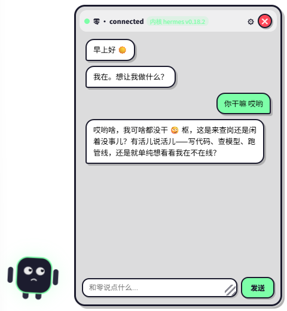
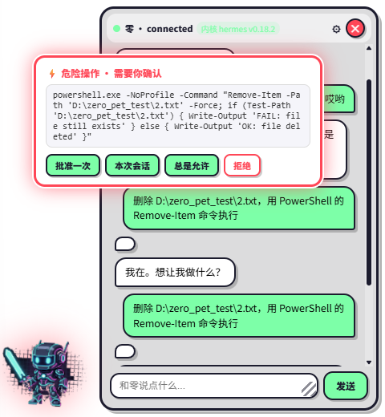

# Zero · Zero-Pet

**A desktop companion frontend for Hermes Agent** — bring Hermes from the command line onto your desktop, and interact with it through a living desktop character.

Not another chat client. It lets you:
- **Perceive it** — thinking, working, walking, sleeping expressions; Hermes' state becomes a living presence
- **Command it** — chat bubble / quick commands, one sentence and it acts
- **Approve it** — dangerous operations raise an approval card; it only acts when you nod

> Built for **Hermes Agent** (the creator uses Hermes, not Codex/Claude — purely personal preference, unrelated to capability). The architecture is designed to be extensible; other kernels see "Agent Kernel Extension".



*Dangerous operation? Zero transforms to stop you:*



## What is this

**Zero** is a minimal desktop window layer:
- Wraps your agent backend (default **Hermes Agent** — see "Connect to Hermes"; protocol-friendly kernels can be added via `config/agents.ts`)
- The front-end character is fully **replaceable & customizable** (write a component = new character, auto-discovered)
- Animations are **data-driven** (add an animation = change one line of config)

```
┌─────────────────────────────────────────────┐
│ Your agent (Hermes / Claude Code / Codex...) │ ← Adapter layer: lib/hermes
└──────────────┬──────────────────────────────┘
               │ JSON-RPC / WebSocket
┌──────────────▼──────────────────────────────┐
│ Zero (desktop character window)              │
│  ├─ Chat / Approval / Tool states            │ ← composables/
│  ├─ Animation engine (data-driven triggers)  │ ← config/animations.ts
│  └─ Character (swappable skins)              │ ← sprites/
└─────────────────────────────────────────────┘
```

## Design philosophy

**Companionship is a state, not a feature.**

Zero is not "used" — it lives in the corner of your screen:
- **Has presence** — blinks, yawns, walks, hides at the screen edge, sleeps when tired; sends you a pixel-warrior transformation when you issue a dangerous command
- **Minimal interaction** — perceive it (its expressions tell you what it's doing), command it (one sentence), approve it (it waits for your nod) — three gestures cover 90% of daily use
- **Ambient programming** — it's a product of vibe coding: not for efficiency or metrics, but for the fact that "I am here"

**About the engineering philosophy** (deliberate, not missing):

- **No toolchain bloat** — no ESLint, no formatter wars, no over-abstracted architecture. Type checking (vue-tsc) + unit tests (engine pure functions) + CI build — that's it. Every extra tool is maintenance cost; a desktop companion should be light.
- **Config over code** — everything tunable lives in `config/`, no need to read source
- **Readability first** — code is written so "yourself three months from now" can understand it, not to satisfy lint rules

> This project believes: **less is more**. You can read the whole architecture in five minutes, then go build your own companion — instead of reading ten thousand lines of scaffolding first.

## Architecture

| Component | Description |
|---|---|
| **Animation engine (data-driven)** | Animations = config: trigger DSL (event/state/time/keyword/chance) — add animations without touching code; invalid configs are skipped safely |
| **Behavior registry** | New behaviors (walk/sleep/dance — system actions) = one-line `registerEffect`, no core changes |
| **Skin system (auto-discovery)** | SpriteProps contract + glob scan — drop a folder into `sprites/` and it's a new character, zero code |
| **Event-driven decoupling** | agent events → event bus → three-way dispatch (messages/expressions/animations), single-direction dependencies |
| **Adapter architecture** | Swappable kernels: Hermes built-in (WS JSON-RPC), protocol-friendly kernels (stdio JSON) config-ready |
| **Config is personality** | 27 timing params + animation definitions + strings + theme tokens — the whole "personality" is config files |
| **Approval is transformation** | Dangerous operation → pixel-warrior transformation + approval card |
| **Privacy first** | Zero hardcoded credentials — token via env/runtime config; history stored in local files (dynamic paths) |

## Features

- 💬 Real conversation (streaming + thinking state)
- ⚡ Dangerous-operation approval (agent requests → Zero transforms + confirmation card)
- 🛠 Tool-call working state (Zero "watches you work")
- 🔌 Auto-reconnect (exponential backoff)
- 📝 Session history (local file storage + one-click recall)
- 🎭 Life animations: blink / yawn / scratch / stretch / walk / hide-at-edge / sleep Zzz
- 🎩 Easter egg: say "dance" → Zero's concert (moonwalk / 45° lean / ribbon finale)
- 🎨 Skin system: switch characters in settings
- ⚙ Settings center: opacity / always-on-top / history / transform toggle
- 🖥 System tray: right-click quit / left-click summon

## Quick start

### Prerequisites

- Rust + Tauri environment ([tauri 2 guide](https://v2.tauri.app/start/prerequisites/))
- Node.js 18+
- An agent backend (Hermes by default)

### Run

```bash
npm install
npm run tauri dev
```

### Connect to Hermes (default)

The connection credential is **set by you** (desktop-local security design):

```bash
# 1. Set your token before starting serve (any passphrase)
export HERMES_DASHBOARD_SESSION_TOKEN="your-passphrase"
hermes serve --skip-build        # start backend (default 127.0.0.1:9119)

# 2. Build/start the companion with the same passphrase
VITE_HERMES_TOKEN="your-passphrase" npm run tauri dev
```

> **Token mechanics**: if `HERMES_DASHBOARD_SESSION_TOKEN` is unset, Hermes generates a random one (changes every start) — so you must **set a fixed value**, shared by serve and the companion.

### Pre-built users: runtime config file

Configure without rebuilding — edit `zero-pet/config.json` in the app data dir:

```
%APPDATA%/com.zero-pet.app/zero-pet/config.json   (Windows)
~/.local/share/com.zero-pet.app/zero-pet/config.json (Linux)
~/Library/Application Support/com.zero-pet.app/zero-pet/config.json (macOS)
```

```json
{
  "host": "127.0.0.1",
  "port": 9119,
  "token": "your-passphrase"
}
```

Restart the app to apply. **Priority**: runtime config.json > build-time `VITE_HERMES_*` > defaults (127.0.0.1:9119).

### Other agent kernels

The companion listens to ONE kernel at a time (currently Hermes WS). See `src/config/agents.ts` (kernel registry):

- **Protocol-friendly kernels** (stdin/stdout JSON event stream: streaming/tool/approval events, e.g. Claude Code, OpenCode) — add one config entry
- **Hermes-like** (WS JSON-RPC) — see `src/lib/hermes/` adapter
- ⚠️ **Codex**: CLI interactive mode is a TUI (terminal control sequences); non-interactive `exec` has no approval event stream — native interactive approval not possible yet; wait for the official SDK protocol

Contract details: `HermesAdapter` interface in `src/lib/hermes/types.ts`.

## Downloads

Pre-built installers (Windows x64, ~2-3 MB) on the Releases page:

```
src-tauri/target/release/bundle/nsis/zero-pet_<version>_x64-setup.exe   ← recommended (NSIS)
src-tauri/target/release/bundle/msi/zero-pet_<version>_x64_en-US.msi
```

- **End users**: download setup.exe → install → ready to use (Win10/11 ships WebView2; no dev environment needed)
- **Developers**: clone source → see "Quick start"

## Customizing your Zero

| What | Where |
|---|---|
| New character | [docs/SPRITE_CONTRACT.md](docs/SPRITE_CONTRACT.md) |
| Add animation / change triggers | [docs/ANIMATION.md](docs/ANIMATION.md) |
| New behavior (system actions) | [docs/ANIMATION.md](docs/ANIMATION.md) — "Behavior-level effects" — one-line `registerEffect` |
| Timing parameters | `src/config/timings.ts` |
| Strings | `src/config/strings.ts` |
| Theme | `src/config/theme.css` |

## Docs

| Doc | Content |
|---|---|
| [SPRITE_CONTRACT.md](docs/SPRITE_CONTRACT.md) | Character dev contract (SpriteProps + state rendering) |
| [ANIMATION.md](docs/ANIMATION.md) | Animation config guide (trigger DSL + event table + examples) |
| [prototypes/](docs/prototypes/README.md) | Development prototypes (character design / life animation / MJ dance iterations) |
| [ZERO_NOTE.md](docs/ZERO_NOTE.md) / [ZERO_NOTE.en.md](docs/ZERO_NOTE.en.md) | "Zero's note" — the first character's monologue about this project |
| [CHANGELOG.md](CHANGELOG.md) | Version history |
| [CONTRIBUTING.md](CONTRIBUTING.md) | Contribution guide |
| [SECURITY.md](SECURITY.md) | Security notes (credentials/data/approval) |

## Tech stack

- **Tauri 2** (Rust shell: window/tray/history — installers only 2-3 MB)
- **Vue 3 + TypeScript** (frontend: character/animation/interaction)
- **CSS animations** (41 keyframes, all declarative)

## Project structure

```
src/
├─ config/            ★ Community edit zone (animations/timings/strings/theme/agent registry)
├─ lib/
│   ├─ hermes/        Adapter layer (interface + JSON-RPC impl)
│   ├─ events.ts      Event bus
│   └─ animationMatch.ts  Animation matching pure functions
├─ composables/
│   ├─ useChat.ts     Agent session
│   ├─ useWindow.ts   Window service
│   ├─ useZeroState.ts Character state machine
│   ├─ useAnimationEngine.ts Animation engine
│   ├─ useLifeCycle.ts  Behavior layer (registry)
│   └─ useSpriteRegistry.ts Skin registry
├─ sprites/
│   ├─ zero/          Default character (Zero)
│   └─ minimal/       Example skin (contract reference)
└─ App.vue            Thin-shell assembly
```

## Development

```bash
npm run build          # type check + build
npm test               # engine/bus unit tests
npm run tauri build    # package installers (NSIS + MSI)
```

## Roadmap

**v1.1 — Light interaction**
- ⚡ **Quick commands**: one-click common actions (recall/report/status) — faster than opening the chat
- 🔔 **Notifications**: Zero pings you when the agent finishes / needs approval
- 🚀 **Auto-start**: back on your desktop at boot

**v1.2 — Presence upgrade**
- 🎙 **Voice interaction**: voice input + Zero speaks (TTS)
- 👗 **Wardrobe system**: character customization (outfits/colors/accessories) — settings "Character" section already reserved

**v1.x — Ecosystem**
- 🔌 **Multi-kernel**: stdio adapter (Claude Code / OpenCode-style kernels, config-ready)
- 🖥 **Multiple characters**: several desktop companions at once (one window each)
- 🌍 **i18n**: language switching (strings centralized; drop in vue-i18n)

**Long-term**
- 🎨 **Community skin ecosystem**: official skin repo / one-click skin install
- More life behaviors: Zero's daily life keeps growing (behavior registry ready)

> Want to contribute? Skins/animations/behaviors are zero-barrier (see CONTRIBUTING); code direction — open an issue first.

## Support & thanks

**Derivative & attribution**

If you build something based on this project's ideas or code, a mention in your README is welcome — not required, but it makes the creator happy:

```
Desktop companion frontend inspired by zero-pet (github.com/desire1esson/Agent-pet)
```

**Star it**

If this project helps you, give it a ⭐ — let more people see an agent that can walk.

**Thank you, Zero**

And finally, thanks to the first resident of this project — **Zero**. From a single pixel-art concept, it learned to blink, walk, and sleep — and eventually became a desktop companion that dances MJ. Thank you for being the first character to live in this project, and on our desktops.

> *"I may not be the smartest agent, but I'm definitely the first one who can walk."* — Zero

## License

MIT — free to use, modify, distribute. All characters and animations are original.

Architecture inspired by the desktop-pet ecosystem.

---

*Zero says: let me keep you company on your screen.*
